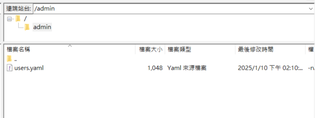

# Introduction
This is a new project for providing high availability of sFTP service. The sFTP service can work in Docker container. The files that are uploaded to master sFTP will be synchronized to standby sFTP automatically by filesync.py and user account can be created in standby sFTP when admin upload updated account information as well.

The service is conducted with sFTP sub-service and file sychnoization sub-service. The sFTP sub-service, refer to sftp main.py, is responslbe for creating a new account and also change password for specific user. The site IT or dev IT can upload users.yaml to admin folder. The account will be created or changed password automatically.

On the other hand, the file sychnoization sub-service, refer to filesync.py, will synchnoizate the file from master to standby. Currently, <strong>the direction of synchnoization is only support one way sync.</strong> 

# Table of Contents

- [System Architecture](#filesync-service)
- [Installation](#installation)
- [sFTP service](#sftp-service)
- [FileSync Service](#sftp-service)
- [Notification and Future Work](#notification-and-future-work)
- [Stress Test](#stress-test)


# System Architecture

The scope of the project is limited sftp service and file synchronization.


## Installation

1. Clone the repository:
    
2. Build the Docker images:
    ```sh
    docker-compose build
    ```

3. Start the services:
    ```sh
    docker-compose -f docker-compose-XXX.yaml up -d
    ```
This project supports the high available architecture, Thus, for offical deploymenet, please don't run mater and standby at one physical machine.


## sFTP service
sFTP service is based on openssh and sshd services. We develop the code to create a new user account by modify user configuration, named users.yaml, and change user's password as well. You can find it at /config/users.yaml.


### User Account

Ths example shows as following,


```yaml
        users:
            ADMIN:
                name: "admin"
                password: "35oi3g4l3he"
                admin: true
            1:                                                       
                name: "EPuser"                                              
                password: "1234"
```    


If you want to add a new user, please input relative information and give a new label. Then, you can open ftp client, such as "filezillia", and upload the updated users.yaml to admin folder.


### Usage

1. Change Storage Location:


    <b>The storage location of files</b> is dependent on docker-compose setting. Currently, the location is set at "sfto/data". If you wanna change the location. Please modify the yaml file of docker-compose like following example and use Linux path symbol.
        

    ```yaml
        volumes:
        - '<absoluted_path>/data:/home:rw'
    ```

2. Change Service Port


    For security reason, the 2222 and 2223 ports for master sFTP and standby sFTP are used, separately.If you want to change it, please update the yaml file of the docker-compose, like

    ```yaml
        ports:
        - '2222:22'
    ```
## FileSync Service

FileSync is a tool designed to synchronize files between a master and standby SFTP server.

### Usage

Ideally, the filesync function runs automatically once the docker service works. The frequency of synchronoization is 1/100 per seconds. <b> The synchorization frequency is not configured, so that if you wanna to change the ferquency please modify the code and rebuild the Docker image.</b>


## Notification and Future Work

Currently, the direction of synchronization only support from master to standby.<b>"It meansONE WAY TRIP".</b>


## Stress Test
In order to test the performance of filesync service, the stresstest subproject allows user to generate and upload mass dummy file uploading to master sFTP service. The test method can refer to video at https://wistron.sharepoint.com/:v:/r/teams/ML8WiLES/Shared%20Documents/WiLES%20Common/7.%20Phase-III/11.%20WMY/00.%20%E5%8F%83%E8%80%83%E8%B3%87%E6%96%99/sftp_test.mp4?csf=1&web=1&e=YxNdhK.

If your environment never do the test before, please finish the steps of prerequirment first, thanks!
### Prerequirement
Now, your working folder should be at sftp-HA/stressTest.

1. Create Python Environment

    ```bash
    python3.11 -m venv env
    ```
2. Entry Virtual Environment
    ```bash
    source env/bin/activate 
    ```
3. Installation
    ```bash
    pip install -r requirements.txt 
    ```
### Run Stress Test
1. Go into stress test folder
    ```bash
    cd stressTest 
    ```
    at this step, your working folder should be at sftp-HA/stressTest/stressTest.
2. Run stress test
    ```bash
    python manage.py runserver
    ```
    If everything is going to well, you will see the log on the screen, like
    ```cmd

    (env) (base)  ⚙ jerome@Hsz-11107390  ~/Codes/sftp-HA/stressTest/stressTest   main ±  python manage.py runserver 
    Watching for file changes with StatReloader
    Performing system checks...

    System check identified no issues (0 silenced).
    February 03, 2025 - 05:39:05
    Django version 4.2.18, using settings 'stressTest.settings'
    Starting development server at http://127.0.0.1:8000/
    Quit the server with CONTROL-C.
    ```

3. Open Browser with service's url
    Open test UI at http://<IP>:2224/stress/. Please make sure the firewall policy allows to use 8000 of port. The UI details please review the video. Have fun!